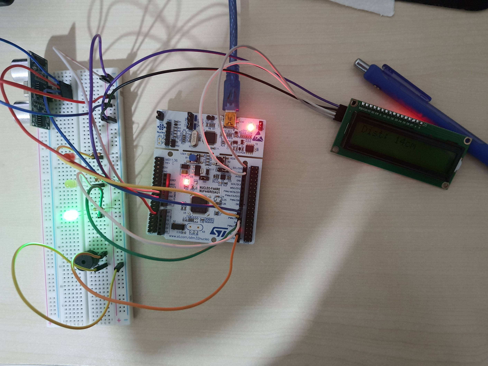

# parking-sensor-system

## Overview
This project is a parking sensor system built using an **STM32F446RE** microcontroller, an **HC-SR04** ultrasonic distance sensor, an **LCD1602A** display with its **PCF8574 I2C expander module**, a buzzer, and LEDs to indicate distance levels. The system measures the distance to an obstacle and displays the value on the LCD screen in centimeters. Additionally, it provides visual and auditory feedback based on the proximity of the obstacle.

 - Configured timers on input capture mode to measure pulses of HC-SR04 distance sensor.

 - Interfaced LCD1602A via custom wrote driver along with PCF8574 I2C expander.

 - Whole system relies on interrupts exhibiting smooth transitions between tasks.

## Components
- **STM32F446RE**

- **HC-SR04 Ultrasonic Sensor**

- **LCD1602A-I2C**: Displays the distance measured by the HC-SR04.

- **Buzzer, LEDs and Breadboard**: 

## Implementation

**Distance Measurement and Timer Configration**: 

- STM32F4 triggers HC-SR04 with 250ms time intervals.

- In order to measure distance, echo pin of HC-SR04 is read. Timer on CHANNEL_1 configured on input capture mode, starts with HC-SR04's call, interrupts 2 times first on rising edge, second on falling edge and records time stamps. When first rising edge signal is captured, polarity of input capture timer is reverted to capture falling edge. The difference between the two timestamps gives the time interval, which is then used to calculate the distance.

- The measured distance is processed and displayed on the LCD, and the LEDs and buzzer provide immediate feedback based on the proximity to an obstacle.


## Code Snippet
```c
void handleTMR4Interrupt(TIM_HandleTypeDef *htim) {

	if (inputCaptureState == ON_RISING_EDGE)
	{
		captureTimeOnRiseEdge(htim);
	}

	else if (inputCaptureState == ON_FALLING_EDGE)
	{
		captureTimeOnFallEdge(htim);
	}
}

void captureTimeOnRiseEdge(TIM_HandleTypeDef *htim) {
	inputCaptureRiseEdgeTime = HAL_TIM_ReadCapturedValue(htim, TIM_CHANNEL_1);

	inputCaptureState = ON_FALLING_EDGE;
	__HAL_TIM_SET_CAPTUREPOLARITY(htim, TIM_CHANNEL_1, TIM_INPUTCHANNELPOLARITY_FALLING);
}
```

## Final Project
Shown on left HC-SR04 sensor seen, and on far right lcd displaying measured distance value of 14cm.




## Reference
 - [LCD1602A-I2C Driver Library](https://github.com/TaskinOkmen/lcd1602a-i2c-driver)